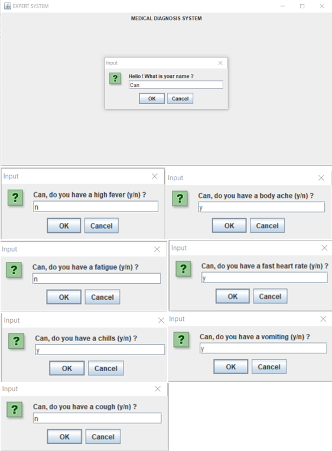

# Medical-Diagnosis-System
Expert System is a system that seeks to adopt human knowledge to the computer, so that the computer can solve problems which are usually done by experts. The purpose of medical expert system is to support the diagnosis process of physicians. It considers facts and symptoms to provide diagnosis. This implies that a medical expert system uses knowledge about diseases and facts about the patients to suggest diagnosis.

## Motivation
This issue caught our attention as it is a real problem in the World. In the treatment, it is very important to make the correct diagnosis first. Misdiagnosis can affect the patient’s life. Considering the factors such as time, cost etc. to train a doctor, an expert systems that imitates an expert and Works correctly will be very useful. In this project, our goal was to design an expert system that successfully diagnoses. 

## Technique
I planned to use a rule-based technique. Rule-based systems are the easiest type of AI. The definition of a rule-based system often relies on expert systems that simulate the cognitive behavior of the human expert in solving a knowledge-intensive challenge. This method is sufficient for diagnostic and classification difficulties.

